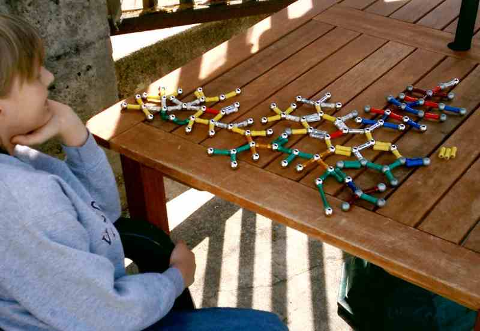

# RNA 2D utilities

## Description

Collection of 2D RNA scripts. A bit like Pycogent but with
more exotic stuff.

## Languages used

- python 2/3
- C++
- [julia 0.3](https://github.com/JuliaLang/julia)

## Contributing

You think your code is interesting/useful/cool, just add it.
Bug reports are very welcome (use the issue feature of github please).
Please use documentation and examples.

## License

This repository is under CC0 1.0 Universal License, unless stated otherwise.
If you disagree with that, [well, that's just, like, your opinion](https://www.youtube.com/watch?v=pWdd6_ZxX8c).

